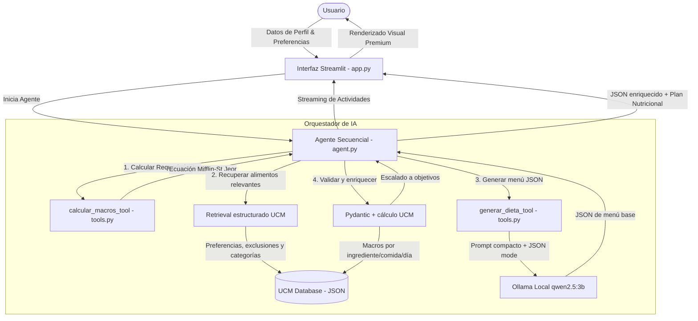

# 🍎 NutriAgent AI: Agente Nutricional Inteligente de Élite

[](https://www.python.org/)
[](https://streamlit.io/)
[](https://langchain.com/)
[](https://ollama.com/)

**NutriAgent AI** es una aplicación web interactiva y un agente de inteligencia artificial diseñado para la planificación y optimización de dietas deportivas personalizadas. Utiliza la fórmula metabólica de **Mifflin-St Jeor** para el cálculo preciso de requerimientos energéticos, recuperación estructurada de alimentos desde la base oficial de la **Universidad Complutense de Madrid (UCM)** y generación local con **Ollama (`qwen2.5:3b`)** para construir menús en JSON validados y recalculados nutricionalmente.

Este proyecto ha sido desarrollado como el **Trabajo Final de Prompting**, integrando técnicas avanzadas de orquestación de agentes (LangChain), bases de datos nutricionales locales y modelos de lenguaje locales (Ollama) con interfaces de usuario premium (Streamlit).

---

## 🛠️ Arquitectura del Sistema

El flujo de información y la interacción de los diferentes componentes de **NutriAgent AI** se estructuran de la siguiente manera:



---

## ✨ Características Principales

1. **Dashboard Web Premium e Interactivo (`app.py`)**:
   - Diseño moderno con tema claro tipo **glassmorphism**, gradientes suaves y tarjetas de alto contraste.
   - **Buscadores Multiselect UCM** integrados para seleccionar con autocompletado y buscador en tiempo real los alimentos a incluir y a excluir del menú (cargados dinámicamente desde la base de datos oficial).
   - **Buscador de Alimentos UCM** en la barra lateral para consultar rápidamente calorías y macronutrientes oficiales en tiempo real.
   - **Monitoreo de estado del servidor Ollama** (Badge en línea/fuera de línea) para asegurar la correcta comunicación con el LLM.
   - Modelo LLM fijado a `qwen2.5:3b` para asegurar reproducibilidad de las pruebas.
   - Formulario de perfil de usuario altamente parametrizable (edad, sexo, altura, peso, nivel de actividad física, objetivo deportivo, alimentos preferidos/excluidos y duración del plan).
   - Panel de depuración con el JSON enriquecido final, incluyendo macros calculados con UCM por ingrediente, comida y día.

2. **Orquestación de Agentes con Streaming en Tiempo Real (`agent.py`)**:
   - Ejecución secuencial de herramientas reales: primero `calcular_macros_tool`, después `generar_dieta_tool`.
   - **Retrieval estructurado sobre UCM**: recupera alimentos relevantes desde `ucm_food_database.json` según preferencias, exclusiones, grupos culinarios y perfil nutricional.
   - **Validación Pydantic**: obliga a aceptar únicamente respuestas con estructura JSON esperada (`plan_type`, `days`, `meals`, `justification`).
   - **Composición inteligente de comidas**: completa propuestas demasiado simples con combinaciones realistas (proteína + carbohidrato + fruta/verdura + grasa saludable) usando alimentos de la base UCM.
   - **Variabilidad semanal**: para planes de 7 días, el LLM genera un día base compacto y el agente lo expande a la semana sustituyendo alimentos por alternativas equivalentes de la base UCM.
   - Renderizado en vivo de las actividades del agente en la interfaz mediante contenedores interactivos de Streamlit (`st.status` y `st.empty`).

3. **Motor de Cálculo y Escalado Nutricional UCM**:
   - Recalcula calorías, proteínas, carbohidratos, grasas y fibra por ingrediente usando la base UCM.
   - Ajusta las raciones por macro dominante (proteína, carbohidrato o grasa) para acercar el menú generado a los objetivos diarios calculados.
   - Enriquece el JSON final con `ucm_macros`, `meal_macros`, `day_macros`, `macro_targets` y `macro_source`.

4. **Herramientas LangChain Especializadas (`tools.py`)**:
   - `calcular_macros_tool`: Implementa de manera determinista la ecuación de **Mifflin-St Jeor** adaptada para deportistas (2.2g de proteína por kg de peso corporal en déficit/superávit, 1.0g de grasa por kg de peso corporal y balance calórico mediante carbohidratos).
   - `generar_dieta_tool`: Diseña un menú base en JSON estricto usando `ChatOllama`, modo JSON, temperatura baja y un catálogo UCM filtrado para reducir latencia.

---

## 📂 Estructura del Repositorio

*   **`app.py`**: Interfaz de usuario final construida en Streamlit. Maneja el diseño visual, barras de progreso de macros, tabs interactivos semanales y el streaming en vivo del agente.
*   **`agent.py`**: Motor de ejecución del agente. Contiene la clase `SequentialNutritionAgentExecutor`, recuperación estructurada UCM, validación Pydantic, composición de comidas, expansión semanal y escalado nutricional.
*   **`tools.py`**: Definición de las LangChain Tools disponibles para el agente (`calcular_macros_tool` y `generar_dieta_tool`).
*   **`setup_models.sh`**: Script en Bash para la automatización de la comprobación del entorno Ollama y la descarga automática de los modelos necesarios (`qwen2.5:3b` y `qwen2.5:1.5b`).
*   **`ucm_food_database.json`**: Base de datos de alimentos parseada. Contiene códigos oficiales, nombres, calorías, proteínas, carbohidratos, grasas y fibra de cada alimento según la guía UCM.
*   **`2023_guiaDMSAMFyC_cap07anexo10.pdf`**: Documento fuente oficial de la Universidad Complutense de Madrid con la tabla de composición de alimentos.
*   **`.gitignore`**: Exclusiones de cachés Python, entornos virtuales, logs y artefactos locales.

---

## 🚀 Requisitos e Instalación

### 1. Clonar e Instalar Dependencias de Python
Asegúrate de tener instalado Python 3.10 o superior. Instala las dependencias necesarias ejecutando:

```bash
pip install streamlit langchain langchain-core langchain-ollama pydantic pypdf requests
```

### 2. Configurar Ollama y Modelos
Este proyecto utiliza modelos de lenguaje locales ejecutados a través de **Ollama**. 
1. Descarga e instala Ollama desde [ollama.com](https://ollama.com).
2. Ejecuta el script Bash provisto para iniciar el servicio automáticamente y descargar los modelos optimizados de la familia `qwen2.5`:

```bash
chmod +x setup_models.sh
./setup_models.sh
```

El script se encargará de:
* Verificar que Ollama esté instalado.
* Asegurar que el servidor local de Ollama (`ollama serve`) esté levantado.
* Realizar el pull automático de `qwen2.5:3b` (modelo fijado por defecto) y `qwen2.5:1.5b` (modelo alternativo de alto rendimiento en CPU).

### 3. Ejecutar la Aplicación
Una vez que el servidor Ollama esté en línea y los modelos descargados, lanza la aplicación Streamlit:

```bash
streamlit run app.py
```

Abre la dirección `http://localhost:8501` en tu navegador para interactuar con la aplicación.

---

## 📚 Base Académica y Científica

### Ecuación de Mifflin-St Jeor
El cálculo de la Tasa Metabólica Basal (TMB) se realiza siguiendo la fórmula científica estándar:
*   **Hombres**: $TMB = 10 \times \text{peso (kg)} + 6.25 \times \text{altura (cm)} - 5 \times \text{edad (años)} + 5$
*   **Mujeres**: $TMB = 10 \times \text{peso (kg)} + 6.25 \times \text{altura (cm)} - 5 \times \text{edad (años)} - 161$

El Gasto Energético Diario Total (TDEE) se obtiene multiplicando la TMB por el factor de actividad física (sedentario: 1.2, ligero: 1.375, moderado: 1.55, intenso: 1.725, muy intenso: 1.9).

### Justificación de Alimentos (UCM)
Todos los ingredientes principales del plan nutricional son mapeados e integrados dinámicamente con sus equivalentes y códigos oficiales en la base de datos oficial extraída del documento de la UCM (con soporte completo para cualquier alimento seleccionado del buscador):
*   **Avena** (Código: `010105`)
*   **Pechuga de Pollo** (Código: `060414`)
*   **Clara de Huevo** (Código: `080101`)
*   **Huevo de Gallina entero** (Código: `080103`)
*   **Aceite de Oliva** (Código: `100110`)
*   **Pan Integral** (Código: `010320`)
*   **Pasta Integral** (Código: `010127` / Equivalente)
*   **Ternera Magra** (Código: `060101` / Equivalente)
*   **Patata Nueva** (Código: `020101` / Equivalente)
*   *Cualquier otro alimento preferido* (se busca en tiempo real en la base de datos, recuperando su código oficial, aportes energéticos por 100g y asignándole una justificación metabólica dinámica).

### RAG Estructurado sobre UCM
El proyecto incorpora un patrón de **RAG ligero basado en datos estructurados**:
*   **Retrieval**: `agent.py` busca alimentos relevantes en `ucm_food_database.json` por preferencias, exclusiones, palabras clave culinarias y perfil nutricional.
*   **Augmentation**: el subconjunto recuperado se pasa al LLM como `contexto_alimentos_json`.
*   **Generation**: `generar_dieta_tool` produce un menú base en JSON.
*   **Grounding y validación**: el backend valida el JSON con Pydantic, completa comidas si es necesario, recalcula macros con UCM y ajusta gramos para acercarse a los objetivos.

No se utiliza una base vectorial, embeddings ni chunking semántico; la recuperación se realiza directamente sobre el JSON estructurado de la guía UCM.
